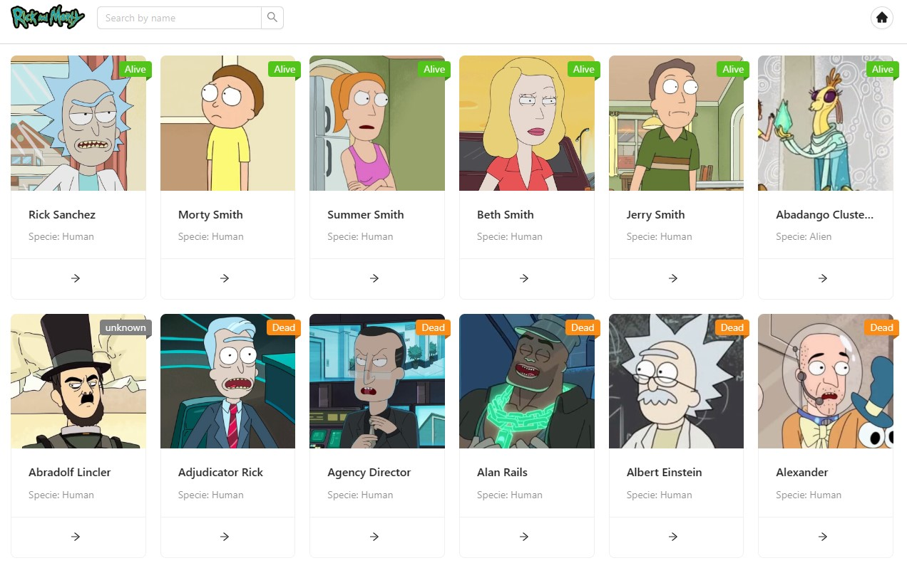

# Rick and Morty App

🔗 Production: [Rick-and-Morty](https://rick-and-morty-rcepeda.vercel.app/)



## Getting Started

First, add the `.env.local`

```env
NEXT_PUBLIC_API_DOMAIN=https://rickandmortyapi.com/api
```

Then, run the development server:

```bash
yarn dev
```

Open [http://localhost:3000](http://localhost:3000) with your browser to see the result.
